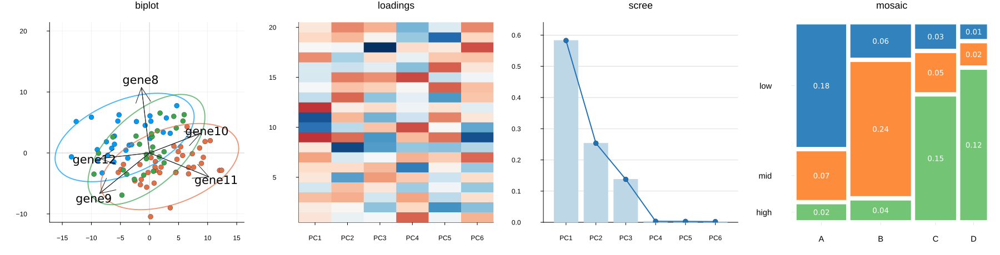

# BigRiverPlots


[](https://github.com/senresearch/BigRiverPlots.jl/actions/workflows/ci.yml)
[](https://codecov.io/gh/senresearch/BigRiverPlots.jl)
[](https://senresearch.github.io/BigRiverPlots.jl/stable)
[](https://senresearch.github.io/BigRiverPlots.jl/dev)
[](https://www.repostatus.org/#active)
[](https://github.com/senresearch/BigRiverPlots.jl/blob/main/LICENSE.md)


## Description

`BigRiverPlots.jl` is a versatile plotting package built in the Julia 
programming language. The package consists of specific plotting recipes, 
designed to streamline data visualization and enhance the process of statistical analysis.



The package is built using [RecipesBase.jl](https://github.com/JuliaPlots/Plots.jl/tree/v2/RecipesBase). 
Its recipes remain lightweight and use `Plots.jl` as a compatible plotting backend.
To render and display these recipes, users must also load the `Plots.jl` package.

The plotting recipes are not tied to a particular statistical model or Julia package. 
They operate directly on common model outputs, such as scores, loadings, and explained variances.

Consequently, the plots can be used with any statistical method or decomposition that produces the required inputs.


## Available Plots

`BigRiverPlots.jl` currently provides the following visualizations:

* **Biplot** — displays observations and variable loadings on the same coordinate system.
* **Confidence plot** — displays uncertainty regions around observations or group means.
* **JIVE variance plot** — summarizes the joint, individual, and residual variation for each data block.
* **Loadings heatmap** — displays variable loadings across multiple components.
* **Loadings plot** — shows the contribution of each variable to a selected component.
* **Mosaic plot** — represents a contingency table using tiles with areas proportional to cell frequencies.
* **Pairs plot** — displays pairwise relationships among several components.
* **Predicted versus observed plot** — assesses the fit of a regression or prediction model.
* **Scores plot** — displays observations in the space defined by two components.
* **Scree plot** — shows the variance explained by each component.
* **Sparsity plot** — shows the number of variables retained in each component.
* **VIP plot** — displays Variable Importance in Projection scores from a projection-based model.

## Installation

The `BigRiverPlots` package can be installed by running:

```julia
using Pkg
Pkg.add("BigRiverPlots")
```

or from the Julia REPL, press `]` to enter pkg mode, and execute:


```
add BigRiverPlots
```

For the most recent (development) version, use:
```
using Pkg
Pkg.add(url = "https://github.com/senresearch/BigRiverPlots.jl", rev="main")
```

## Contributing

We welcome contributions that improve documentation, performance, testing, and functionality. 
Users can contribute by opening an issue or submitting a pull request.

## Questions

If you have questions about contributing or using `BigRiverPlots` package, please communicate with the authors via GitHub.
