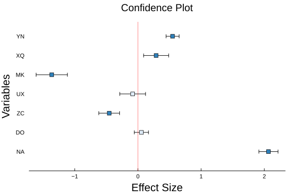

# BigRiverPlots.jl: A collection of plotting recipies for statistical analyses

[](https://github.com/senresearch/BigRiverPlots.jl/actions/workflows/ci.yml)
[](https://codecov.io/gh/senresearch/BigRiverPlots.jl)

`BigRiverPlots.jl` is a versatile plotting package built in the Julia programming language. The package consists of specific plotting recipes, designed to streamline data visualization and enhance the process of statistical analysis.

## Features
Currently we offer one function, and we will add more with time.

- `confidenceplot()`: This function is designed to create vertical
  confidence plots. These plots can be used to visualize regression
  coefficients and their confidence intervals visually.


## Installation
To install `BigRiverPlots.jl`, you can use Julia's package manager. Here is the command:

```julia
using Pkg
Pkg.add("BigRiverPlots")
```

## Usage
After installing `BigRiverPlots.jl`, you can include it in your Julia script using the following command:

```julia
using BigRiverPlots
```

- Confidence plots:

```julia
# ε contains variation relative to x-estimates  
plot_confidence(x, y, ε)
```

## Examples
The following examples provide a basic idea of how to use the functions provided by `BigRiverPlots.jl`. Before proceeding, ensure that you've installed `BigRiverPlots.jl` and imported it into your Julia script using `using BigRiverPlots` along with `Plots.jl`.

### Example 1: Confidence Plot
```julia
using BigRiverPlots
using Distributions, Random
using Plots

########
# Data #
########

Random.seed!(1203)

x = randn(7)

y = repeat([""], 7)
y = map(x -> randstring('A':'Z', 2), y)

ε = rand(Uniform(0.1,0.25), 7)

########
# Plot #
########
plot_confidence(x, y, ε,
    title = "Confidence Plot\n",
    xlabel = "Effect Size",
    ylabel = "Variables")
```




## Contribution
Contributions to BigRiverPlots.jl are welcome and appreciated. If you'd like to contribute, please fork the repository and make changes as you'd like. If you have any questions or issues, feel free to open an issue on the repository.

## License
`BigRiverPlots.jl` is licensed under the [GNU AFFERO GENERAL PUBLIC LICENSE](LICENSE). For more information, please refer to the LICENSE file in the repository.

## Support
If you have any problems or questions using `BigRiverPlots.jl`, please open an issue on the GitHub repository. We'll be happy to help!
